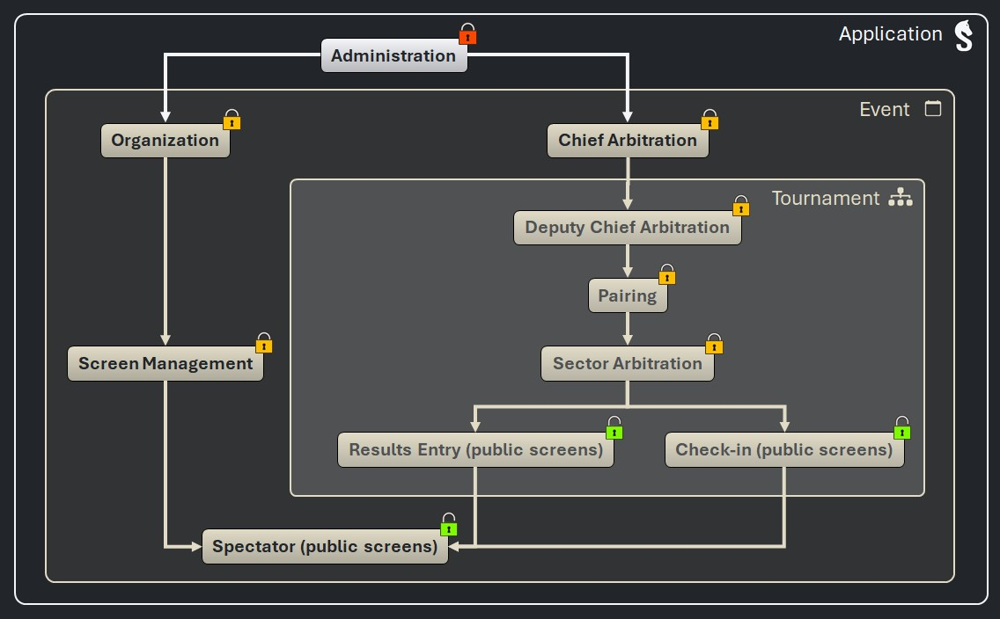

# Connect devices to the server

_Sharly Chess_ can be used like traditional chess competition management software: the arbiter manages the competition alone, on their computer.

_Sharly Chess_ was originally designed to connect devices (computers, tablets, smartphones) to the Sharly Chess server to:
- score players;
- enter results;
- view pairings, results, rankings, etc.

**Since version 3.1, it is also possible to delegate other operations to network devices, thanks to access levels.**

---

## Access levels

Access levels allow you to configure in a very flexible and intuitive way the operations that can be performed on devices connected to the network.

- [See the permissions of each access level]()

_Sharly Chess_ access levels are organized hierarchically:

-  “Basic” access levels are granted by default to all connected devices (they can be revoked).
-  To gain higher access levels, devices must be authenticated by logging in with an account.
-  The application's _Administration_ access level is reserved for the _Sharly Chess_ server.

---

## Accounts

Accounts are declared on the _Sharly Chess_ server:
- a lastname (mandatory) and a firstname (optional);
- a password.

They allow connected devices to be granted all access levels, except for the application's _Administration_ (reserved for the _Sharly Chess_ server).

{: .note }
> :information_source: It is possible to deactivate an account and reactivate it later.

Account passwords are encrypted on the _Sharly Chess_ server (if forgotten, they cannot be recovered and must be changed).

{: .warning }
> :warning: Account passwords should be shared with trusted individuals only!