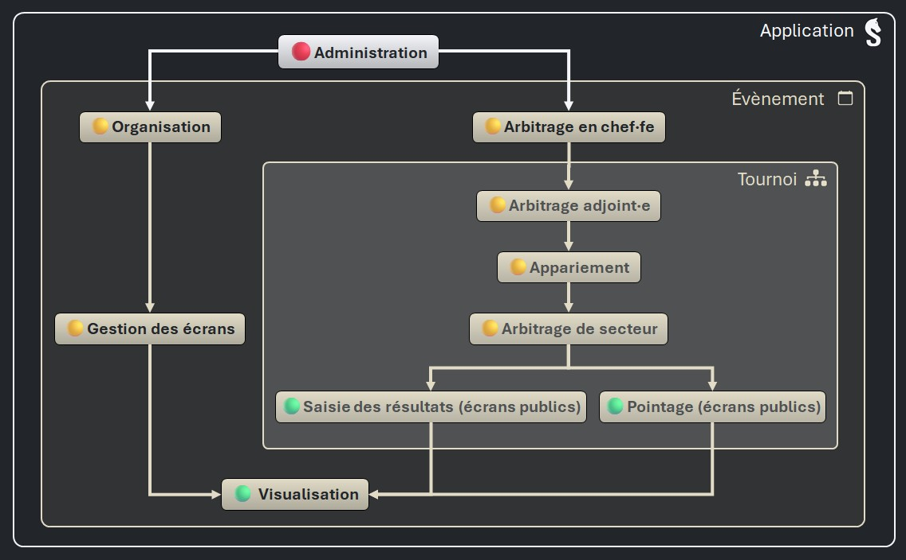

# Connecter des appareils au serveur

_Sharly Chess_ peut être utilisé comme les logiciels classiques de gestion de compétitions d'échecs : l'arbitre gère la compétition seul·e, sur son ordinateur.

_Sharly Chess_, dès son origine, a été conçu pour connecter des appareils (ordinateurs, tablettes, smartphones) sur le serveur _Sharly Chess_ pour :
- pointer les joueur·euses ;
- saisir les résultats ;
- visualiser les appariements, les résultats, les classements...

**Depuis la version 3.1, il est également possible de déléguer d'autres opérations aux appareils du réseau, grâce aux niveaux d'accès.**

---

## Les niveaux d'accès

Les niveaux d'accès permettent de configurer de manière très souple et intuitive les opérations qui peuvent être réalisées sur les appareils connectés au réseau.

- [Voir les permissions de chaque niveau d'accès]()

Les niveaux d'accès de _Sharly Chess_ sont organisés de manière hiérarchique :

- 🟢 Les niveaux d'accès « basiques » sont accordés par défaut à tous les appareils connectés (ils peuvent leur être retirés).
- 🟡 Pour bénéficier de niveaux d'accès plus élevés, les appareils du réseau doivent être authentifiés en se connectant avec un compte.
- 🔴 Le niveau d'accès _Administration_ (de l'application) est réservé au serveur _Sharly Chess_.

---

## Les comptes

Les comptes sont déclarés sur le serveur _Sharly Chess_ :
- un nom (obligatoire) et un prénom (facultatif) ;
- un mot de passe.

Ils permettent d'accorder aux appareils connectés tous les niveaux d'accès, à l'exception de l'_Administration_ de l'application (réservé au serveur _Sharly Chess_).

Il est possible de désactiver un compte et de le réactiver ultérieurement. 

{: .warning }
> :warning: Les mots de passe des comptes ne doivent être communiqués qu'à des personnes de confiance !
