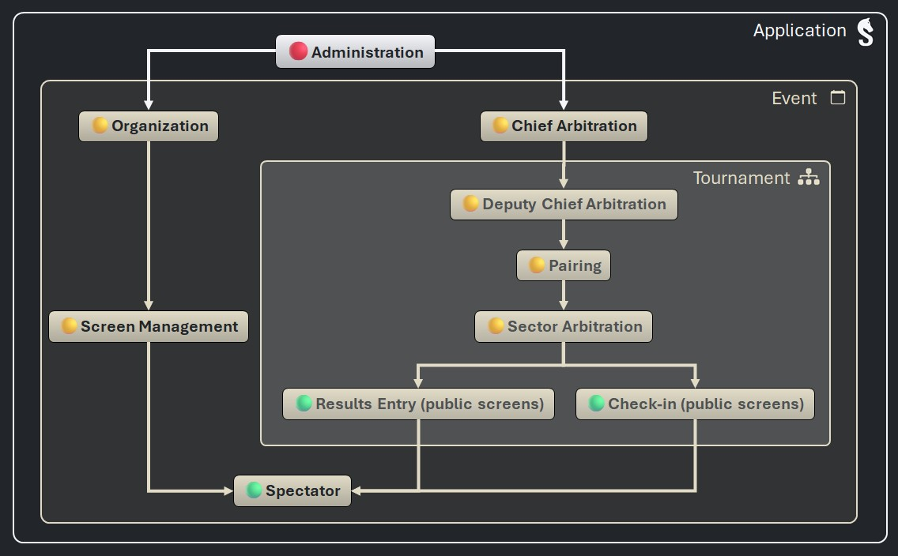

# Staff Accounts

You can create accounts for other arbiters or staff so they can access the _Sharly Chess_ server from another device.

Accounts are managed via the **Staff** tab. To create an account, you must specify:

- a last name (required) and a first name (optional)
- a password

Accounts grant staff members certain _access levels_, with the exception of the application's _Administration_ access level, which is reserved for the _Sharly Chess_ server itself.

It is possible to deactivate an account and reactivate it later.

## Access levels

Access levels let you define the operations that staff can perform on devices connected to the _Sharly Chess_ server via the network.
You can also adjust the default access level for unauthenticated devices, for example if you wish to disallow access to public screens.

_Sharly Chess_ access levels are organized hierarchically:

- 🟢 “Basic” access levels are granted by default to all connected devices (they can be revoked).
- 🟡 To gain higher access levels, devices must be authenticated by logging in with an account.
- 🔴 The application's _Administration_ access level is reserved for the _Sharly Chess_ server.

:point_right: [See the permissions of each access level]()
