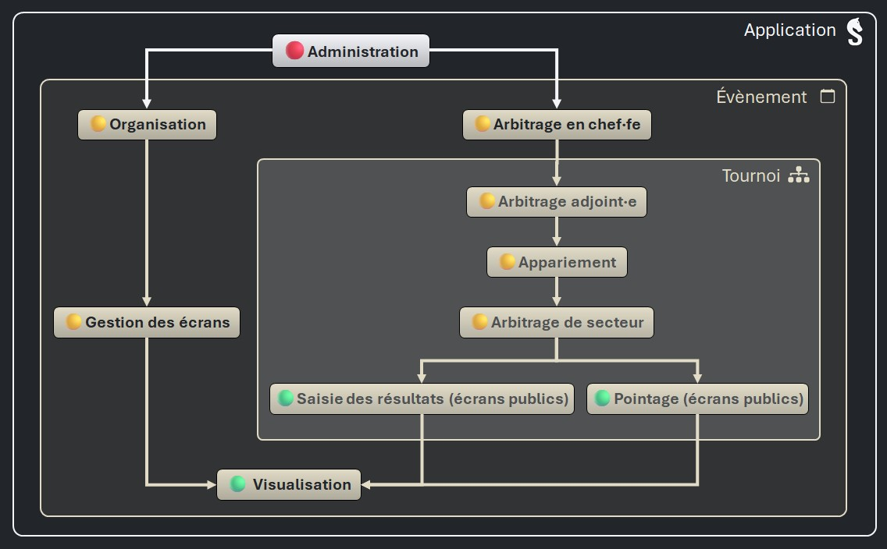

# Comptes du staff

Vous pouvez créer des comptes pour d’autres arbitres ou membres du staff afin qu’ils puissent accéder au serveur _Sharly Chess_ depuis un autre appareil.

Les comptes sont gérés via l’onglet **Staff**. Pour créer un compte, vous devez préciser :

- un nom de famille (obligatoire) et un prénom (facultatif)
- un mot de passe

Les comptes accordent aux membres du staff certains _niveaux d’accès_, à l’exception du niveau d’accès _Administration_ de l’application, qui est réservé au serveur _Sharly Chess_ lui-même.

Il est possible de désactiver un compte et de le réactiver ultérieurement.

# Les niveaux d'accès

Les niveaux d'accès permettent de configurer de manière très souple et intuitive les opérations qui peuvent être réalisées sur les appareils connectés au réseau.

Les niveaux d'accès de _Sharly Chess_ sont organisés de manière hiérarchique :

- 🟢 Les niveaux d'accès « basiques » sont accordés par défaut à tous les appareils connectés (ils peuvent leur être retirés).
- 🟡 Pour bénéficier de niveaux d'accès plus élevés, les appareils du réseau doivent être authentifiés en se connectant avec un compte.
- 🔴 Le niveau d'accès _Administration_ (de l'application) est réservé au serveur _Sharly Chess_.

:point_right: [Voir les actions autorisées de chaque niveau d'accès]()
